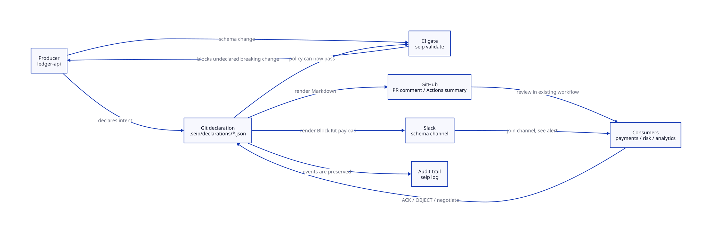
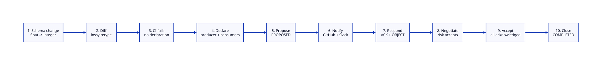
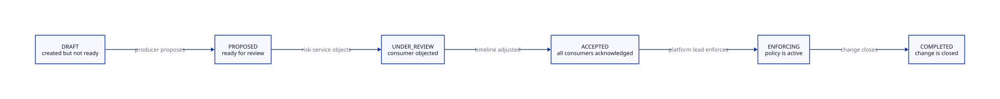

# SEIP Demo Runbook

Plain-English guide for running and narrating the SEIP full-blown demo.

## What This Demo Shows

Imagine one team owns an API schema and three other teams depend on it. The owner wants to change a field from a decimal number to an integer. That sounds small, but it can break downstream code, reports, and fraud models.

SEIP makes that change visible before it ships. The demo shows how:

- CI catches the risky schema change.
- The producer creates one declaration file in Git.
- GitHub and Slack can surface the same declaration.
- Consumers respond in a shared lifecycle.
- The final decision is auditable.

The key idea:

> SEIP is not another meeting, dashboard, or notification system. It is a Git-backed declaration that existing tools can read, review, notify from, and enforce.

## Adoption Use Case

The demo is written for a platform or data engineering team evaluating SEIP as an adoption wedge. It shows a realistic rollout path rather than a synthetic happy path:

1. Add a CI gate that catches an undeclared lossy schema change.
2. Create one declaration that records intent, impact, consumers, timeline, and migration notes.
3. Render that declaration into GitHub and Slack surfaces without making either one the source of truth.
4. Let consumers validate locally, acknowledge, object, or negotiate more time.
5. Enforce and close the change only after the recorded lifecycle reaches the right state.
6. Keep the final audit trail in Git.

## Cast Of Characters

| Role | In the demo | Plain-English meaning |
|------|-------------|-----------------------|
| Producer | `ledger-api` | The team changing the schema |
| Consumers | `payments-api`, `risk-service`, `analytics` | Teams that depend on the schema |
| CI gate | `seip validate` | The automated check that blocks unsafe changes |
| Declaration | `.seip/declarations/seip_transaction_value_precision.json` | The shared record of the proposed change |
| GitHub adapter | `seip notify --adapter github` | Markdown for a PR comment or Actions summary |
| Slack adapter | `seip notify --adapter slack` | Channel-friendly alert payload |

## One-Minute Mental Model



Diagram source: `docs/diagrams/demo-mental-model.d2`

Narration:

> "SEIP keeps one canonical file in Git. CI, GitHub, Slack, and consumers all work from that same file, so coordination does not live only in chat history."

## Scenario Sequence



Diagram source: `docs/diagrams/demo-scenario-sequence.d2`

Narration:

> "The demo is deliberately not a happy path only. One consumer objects, the producer adjusts the timeline, and the lifecycle records the negotiation."

## Lifecycle In The Demo



Diagram source: `docs/diagrams/demo-lifecycle.d2`

Narration:

> "This is why SEIP is more than a diff. The state tells reviewers whether a breaking change is still being negotiated, accepted, enforcing, or done."

## Quick Run

Run from the repository root:

```bash
npm run demo
```

Expected result:

- Exit code `0`.
- Final output includes `SEIP Full-Blown Demo`.
- Final declaration status is `COMPLETED`.
- Final summary includes `No SEIP server, database, or notification state store required.`

The demo writes to:

```text
/tmp/seip-full-blown-demo
```

It deletes and recreates that folder every time it runs.

To isolate a presentation or test run from the default workspace:

```bash
SEIP_DEMO_DIR=/tmp/seip-demo-presentation npm run demo
```

## How To Present The Demo

### Opening

Say:

> "We are going to simulate a schema owner making a risky change. The important part is not that SEIP detects every possible schema issue. The important part is that once a risky change exists, the intent, review state, consumer responses, and audit history all live in one Git-backed declaration."

### Step 1: The Risky Change

The producer changes:

```text
transaction.value: float -> integer
```

Plain-English meaning:

> "We used to send a decimal amount, like 12.34. Now we want to send integer minor units, like 1234. That can be safe if everyone is ready, but dangerous if someone still expects decimals."

### Step 2: CI Blocks The Undeclared Change

The demo runs:

```bash
seip validate schema-v1.json schema-v2.json --strict
```

Expected moment to point out:

```text
Build FAILED
transaction.value (retype) has no Schema Change Declaration
```

Say:

> "This is the first win. Before we build notifications, dashboards, or culture around it, CI already stops the surprise breaking change."

### Step 3: The Declaration Is Created

The producer creates:

```text
.seip/declarations/seip_transaction_value_precision.json
```

This file records:

- what is changing
- why it is breaking
- who owns it
- who must respond
- migration strategy
- proposed timeline
- audit events

Say:

> "Instead of scattering this across a PR, a Jira ticket, and a Slack thread, we now have one durable artifact."

### Step 4: GitHub And Slack Surface The Same State

The demo generates GitHub Markdown:

```bash
seip notify seip_transaction_value_precision \
  --adapter github \
  --repo-url https://github.com/acme/ledger-api
```

It also generates Slack dry-run JSON:

```bash
seip notify seip_transaction_value_precision \
  --adapter slack \
  --webhook mock://slack/schema-changes \
  --repo-url https://github.com/acme/ledger-api \
  --dry-run \
  --json
```

Say:

> "GitHub and Slack are not competing sources of truth. They are just different ways of showing the same declaration."

### Step 5: Consumers Respond

In the demo:

- `payments-api` acknowledges.
- `risk-service` objects.
- the timeline is adjusted.
- `risk-service` acknowledges after negotiation.
- `analytics` acknowledges.

Say:

> "This is the human part made machine-readable. SEIP does not remove negotiation. It gives negotiation a state, a timeline, and an audit trail."

Important limitation to say out loud:

> "`validate-consumer` is the integration point, not a universal validator. In a real rollout each consumer wires this step to their own parser tests, queries, dbt models, contract tests, or model checks before responding."

### Step 6: The Change Closes

The demo ends with:

- `ACCEPTED`
- `ENFORCING`
- `COMPLETED`

Say:

> "At the end, we know who reviewed the change, who objected, how it was resolved, and when it moved into enforcement."

## What To Look For In The Terminal

| Demo section | What matters |
|--------------|--------------|
| Step 2 | `retype (lossy)` and `BREAKING` prove type risk is visible |
| Step 3 | `Build FAILED` proves CI catches undeclared breaking changes |
| Step 4 | declaration file proves intent becomes durable Git state |
| Step 6 | GitHub Markdown proves PR or Actions integration is straightforward |
| Step 7 | Slack dry-run proves team-channel delivery is pluggable |
| Step 8 | `OBJECTED` proves this is not blind approval |
| Step 11 | `COMPLETED` plus `seip log` proves auditability |

## Using The Generated Payloads

### GitHub Actions Summary

In a workflow, write the GitHub adapter output to `$GITHUB_STEP_SUMMARY`:

```bash
npx seip notify seip_transaction_value_precision \
  --adapter github \
  --repo-url "$GITHUB_SERVER_URL/$GITHUB_REPOSITORY" \
  >> "$GITHUB_STEP_SUMMARY"
```

### Pull Request Comment

If the GitHub CLI is available:

```bash
npx seip notify seip_transaction_value_precision \
  --adapter github \
  --repo-url "$GITHUB_SERVER_URL/$GITHUB_REPOSITORY" \
  | gh pr comment "$PR_NUMBER" --body-file -
```

### Slack Dry Run

Use dry-run mode when presenting locally:

```bash
npx seip notify seip_transaction_value_precision \
  --adapter slack \
  --webhook mock://slack/schema-changes \
  --repo-url https://github.com/acme/ledger-api \
  --dry-run \
  --json
```

### Real Slack Delivery

Set a real incoming webhook and omit `--dry-run`:

```bash
npx seip notify seip_transaction_value_precision \
  --adapter slack \
  --webhook "$SLACK_SCHEMA_WEBHOOK" \
  --repo-url https://github.com/acme/ledger-api
```

## Common Questions

### Is SEIP replacing GitHub or Slack?

No. GitHub and Slack stay where they are. SEIP gives them a shared artifact to display or enforce.

### Is SEIP a schema registry?

No. A schema registry stores schemas and compatibility rules. SEIP records intent, review status, consumer responses, and lifecycle state around schema evolution.

### Does the demo send real Slack messages?

No. It uses `--dry-run` and a mock webhook so the demo is safe to run anywhere.

### Does the GitHub adapter call the GitHub API?

No. It emits Markdown. You can pipe that Markdown to a PR comment, `$GITHUB_STEP_SUMMARY`, or internal tooling.

### Is consumer validation real?

The demo shows the validation hook and lifecycle. The reference CLI currently simulates the validation internals. Real teams would connect `validate-consumer` to local queries, parser tests, ORM checks, dbt models, or contract tests.

### What should an adopter copy first?

Start with the CI gate and declaration lifecycle. Use `examples/github-actions-template.yml` as a starting point, then add `seip notify` only after the team has agreed where declarations should be surfaced.

## Verification

Run the demo integration test:

```bash
node --test test/demo.test.mjs
```

Run the full suite:

```bash
npm test
```

Expected result:

- `test/demo.test.mjs` passes.
- Full suite passes.

## Troubleshooting

### `npm run demo` cannot find the CLI

Run the command from the repository root. The demo resolves the CLI at `bin/seip.mjs`.

### CI validation unexpectedly passes in step 3

Remove the demo workspace and rerun:

```bash
rm -rf /tmp/seip-full-blown-demo
npm run demo
```

The demo normally recreates the workspace automatically, but this confirms no stale files are involved.

### Slack delivery fails

Use `--dry-run --json` first. Real delivery requires a valid Slack incoming webhook URL.

### GitHub notification does not create a PR comment

That is expected. The GitHub adapter emits Markdown only. Pipe it to `$GITHUB_STEP_SUMMARY`, `gh pr comment`, or your own automation.

### Terminal output is too long

For a short presentation, focus on:

- Step 3: CI gate blocks undeclared breaking change.
- Step 6: GitHub PR comment / Actions summary.
- Step 7: Slack channel dry-run.
- Step 8: Consumers validate and respond.
- Step 11: Audit log, enforcement, and closure.

## Cleanup

The demo workspace can be removed at any time:

```bash
rm -rf /tmp/seip-full-blown-demo
```

No repository files are modified by running the demo.
