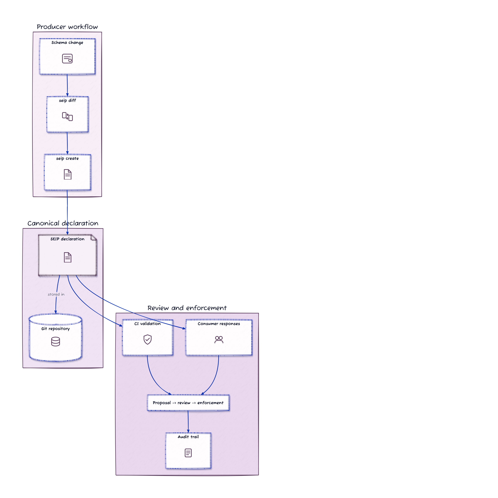
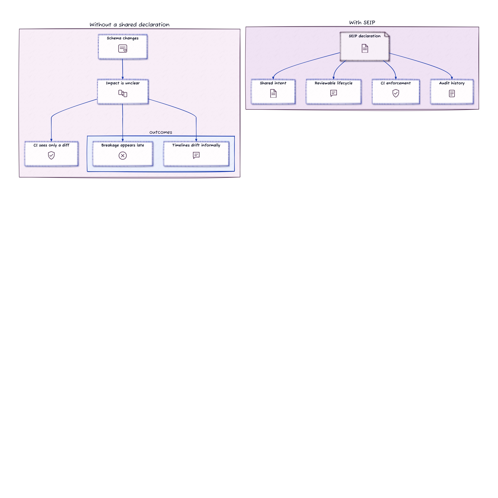
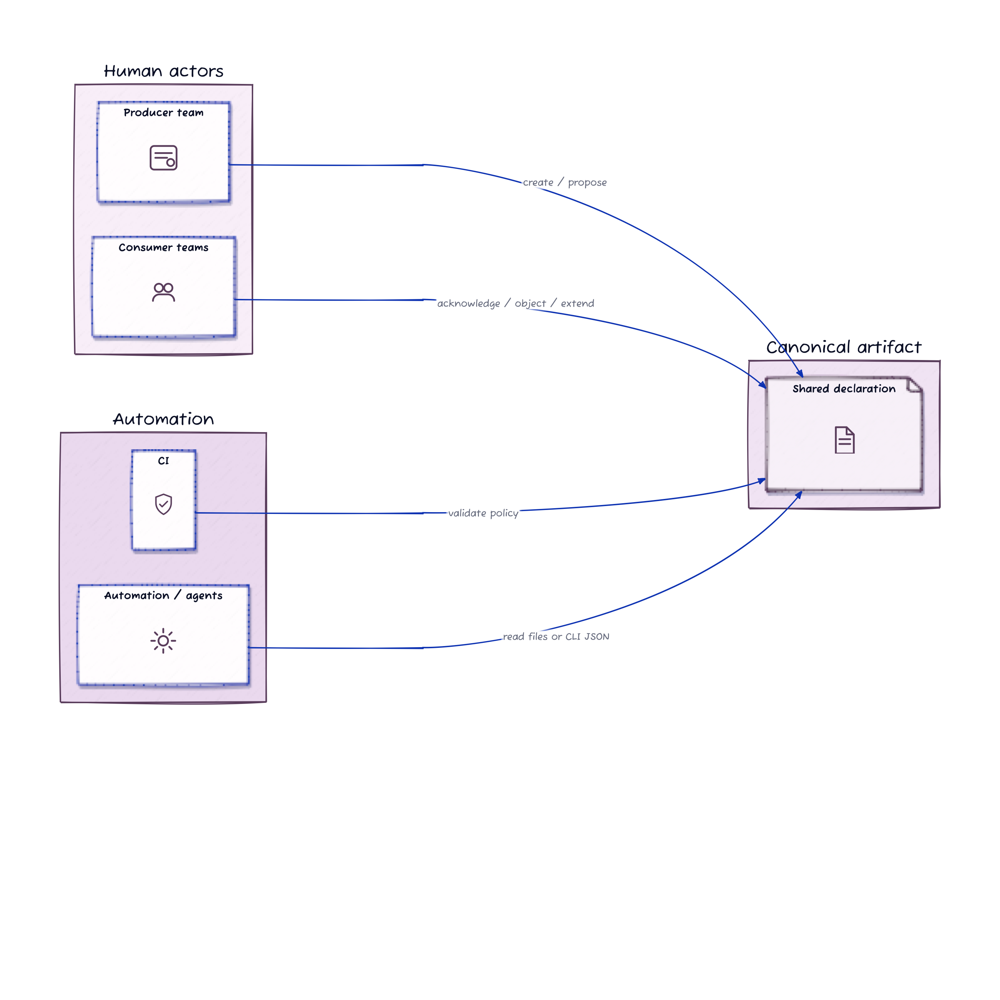
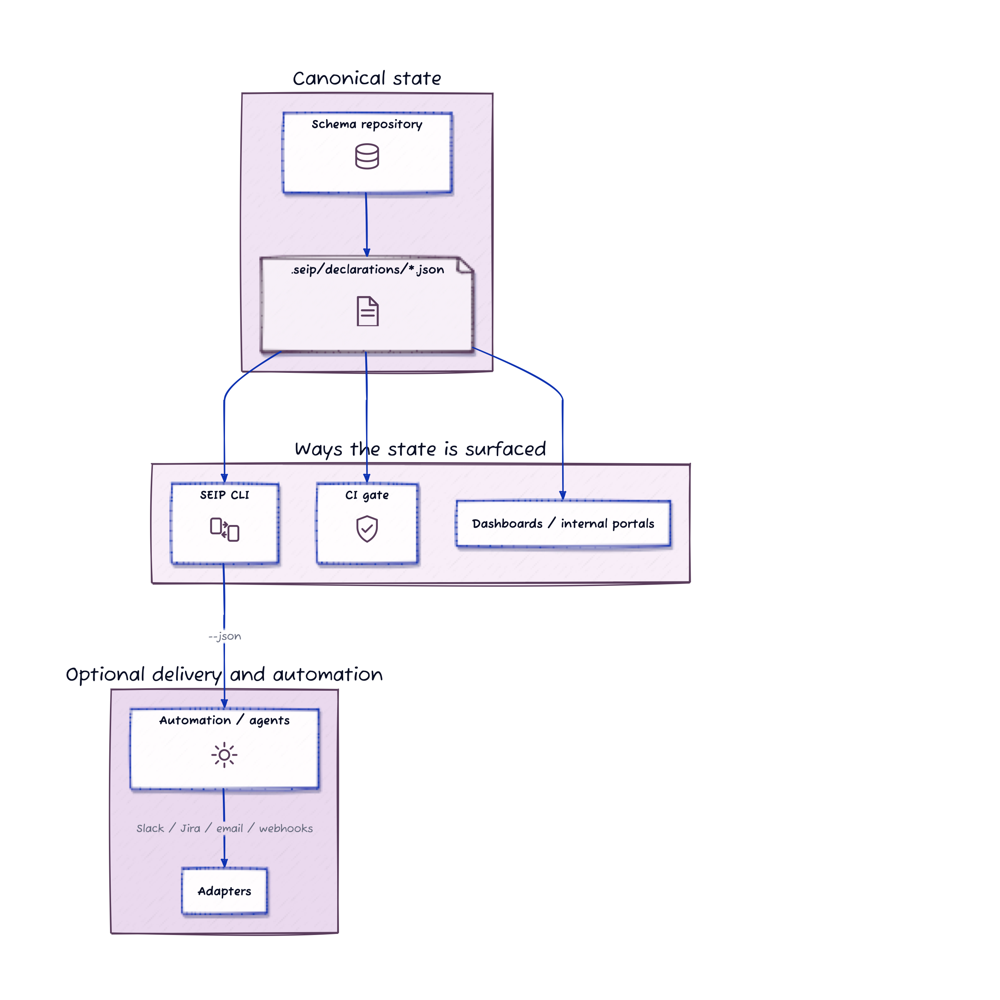
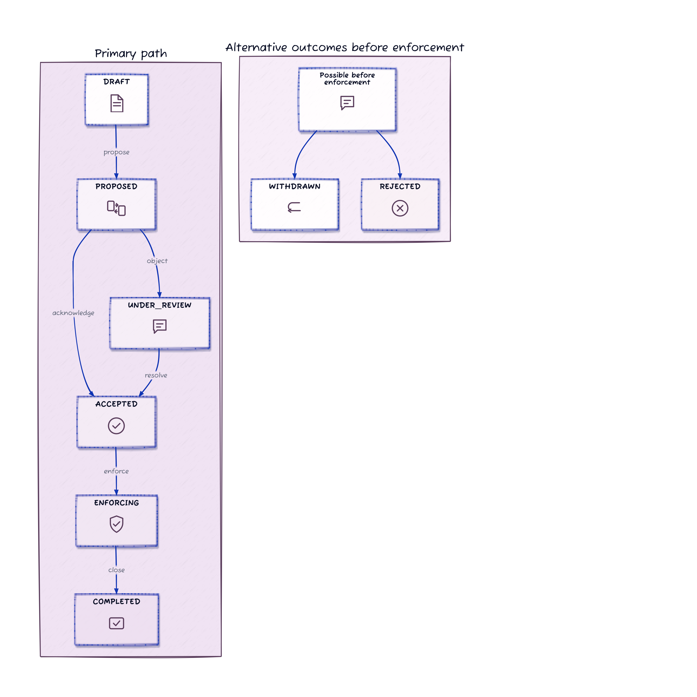
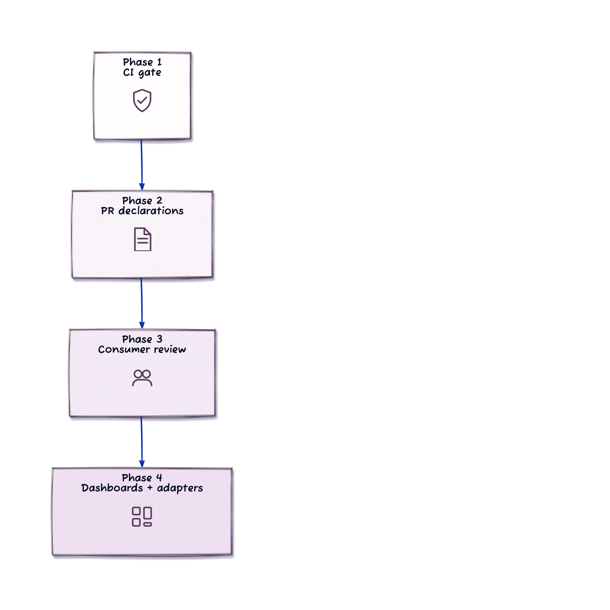

# SEIP

*Schema Evolution Intent Protocol*

## Git-Native Coordination For Breaking Schema Changes

**Whitepaper v0.1 · March 2026**

*Publication candidate. This version is intended as the primary review and circulation draft.*

SEIP defines a Git-native declaration format and reference CLI for making breaking schema changes explicit, reviewable, and enforceable before rollout.

## Abstract

Breaking schema changes create coordination risk across producer and consumer teams because impact, timing, and approval state are often distributed across pull requests, tickets, release notes, and chat. The missing piece is not necessarily more process. It is a shared, machine-readable declaration that makes breaking intent visible before rollout.

SEIP, the Schema Evolution Intent Protocol, defines a Git-native declaration format and reference CLI for expressing schema change intent, recording review state, and validating breaking changes in CI. The reference implementation operates on canonical declaration files stored in Git and assumes existing Git and CI infrastructure rather than a SEIP-owned service. SEIP does not replace schema registries, migration systems, or delivery pipelines. It standardizes the declaration and lifecycle needed to make schema changes reviewable, enforceable, and auditable across teams.



*Figure 0. SEIP reference flow: detect a schema change, create a declaration, validate it in CI, collect downstream responses, and retain an audit trail.*

## 1. Problem Framing

Schema changes are already coordinated in most organizations. The problem is that the coordination is usually fragmented.

Teams often use some combination of:

- pull requests
- change tickets
- chat threads
- release notes
- changelog entries
- team-specific planning boards

These tools are useful, but they do not usually give producer and consumer teams a single shared artifact that answers a few basic questions:

- Is this change intended to be breaking?
- Which objects or fields are affected?
- Which teams are expected to respond?
- What compatibility strategy is planned?
- What timeline is being proposed?
- Has the change been acknowledged, objected to, or completed?

Without a shared declaration, the difference between an approved breaking change and a surprise breaking change is often visible only in human memory, scattered messages, or repo-local context.



*Figure 1. Without a shared declaration, impact, timing, and approval state are easy to lose inside ordinary delivery activity.*

## 2. Goals And Boundaries

SEIP is intentionally narrow.

### Goals

- make potentially breaking changes visible before rollout
- create a standard declaration that humans and automation can both inspect
- support a reviewable lifecycle for producer and consumer teams
- preserve an audit trail of the coordination process
- provide a low-friction CI adoption wedge

### Non-Goals

- replacing schema registries
- defining how each data platform should diff schemas internally
- prescribing downstream migration internals for every consumer
- acting as a built-in notification platform
- replacing domain-specific contract testing or migration tooling

This boundary matters. A credible protocol is easier to adopt when it solves one clear problem well.

## 3. Working Definition

SEIP is a Git-native schema change coordination protocol and reference CLI for declaring, reviewing, validating, and closing cross-team schema changes.

## 4. Core Declaration Model

SEIP is built around one primary artifact: the declaration.

A declaration is a JSON document stored in version control that captures:

- the change summary
- whether the producer believes the change is breaking
- the affected objects or fields
- the migration strategy at a protocol level
- the timeline for review, deprecation, and removal
- the set of downstream consumers expected to respond
- the audit history of how the declaration moved through its lifecycle

### Roles And Responsibilities

- **Producer:** the team changing the schema
- **Consumer:** any downstream team or system owner affected by that schema
- **Automation:** CI, scripts, or internal tooling acting on behalf of those teams

Humans and automation interact with the same declaration rather than maintaining separate sources of truth.



*Figure 2. Producers, consumers, CI, and automation all work against the same declaration rather than separate coordination artifacts.*



*Figure 3. Git holds the canonical declaration state, while CI, dashboards, and adapters surface or consume it.*

## 5. Declaration Lifecycle

SEIP defines a lifecycle so that declarations are more than static files. They become reviewable records of coordination.

The current reference implementation supports the following declaration states:

- `DRAFT`
- `PROPOSED`
- `UNDER_REVIEW`
- `ACCEPTED`
- `ENFORCING`
- `COMPLETED`
- `WITHDRAWN`
- `REJECTED`

In practice, a common path is:

`DRAFT -> PROPOSED -> ACCEPTED -> ENFORCING -> COMPLETED`

Consumer responses such as `ACKNOWLEDGED`, `OBJECTED`, and `EXTENSION_REQUESTED` help determine whether the declaration remains proposed, moves under review, or becomes accepted.



*Figure 4. Declarations move through a compact lifecycle, with consumer responses shaping review and enforcement decisions.*

## 6. Canonical State And Discovery

SEIP separates canonical state from distribution.

- The declaration is stored in Git at `.seip/declarations/<declaration_id>.json`
- Git is the source of truth
- CI can validate changes against those declarations
- Pull requests can surface declaration files for human review
- Dashboards or notification adapters can be added later

This distinction is important. SEIP itself is not a webhook platform. It does not require every downstream team to watch every upstream repository manually. Instead, it defines a portable declaration format that existing delivery mechanisms can surface.

In other words:

- **canonical state:** declaration JSON in Git
- **distribution:** CI checks, PR review, dashboards, or adapters
- **automation interface:** declaration files plus machine-readable CLI output

### Transport And State Sync

SEIP is transport-agnostic. It specifies the declaration format and lifecycle semantics; it does not prescribe one universal synchronization mechanism between repositories or teams.

In v0.1, the reference CLI operates on the repository that contains the canonical declaration. That model is sufficient for shared repositories, monorepos, and CI-mediated review flows. It does not, by itself, solve cross-repository authorization, identity, or distributed consensus.

Organizations that need broader coordination may layer SEIP onto existing pull request workflows, CI jobs, internal portals, or future adapter mechanisms. Those mechanisms distribute or reflect protocol state; they are not part of the protocol definition itself.

## 7. Reference CLI Surface

The reference CLI is the shortest path from schema diff to governed coordination.

Current commands include:

- `seip init`
- `seip diff <before> <after>`
- `seip create [options]`
- `seip propose <id>`
- `seip respond <id> --team <name> ...`
- `seip status [id]`
- `seip log <id>`
- `seip validate <before> <after>`
- `seip lint`
- `seip enforce <id>`
- `seip close <id>`

This matters for developer experience. A protocol becomes far more usable when its reference implementation makes the happy path obvious.

The reference CLI also rejects unknown response enums and treats malformed required timestamps as declaration errors. That keeps the reference implementation aligned with the protocol rules it asks teams to rely on.

## 8. Declaration Example

The declaration below represents a breaking rename in a fictional financial platform.

```json
{
  "seip_version": "0.1.0",
  "declaration_id": "seip_rename_institution",
  "created_at": "2026-03-25T09:00:00.000Z",
  "status": "PROPOSED",
  "producer": {
    "team": "ledger-api"
  },
  "change": {
    "type": "rename",
    "breaking": true,
    "summary": "Rename institution to primary_financial_institution",
    "affected_objects": [
      {
        "object": "account_record",
        "property": "institution"
      }
    ],
    "renames": [
      {
        "object": "account_record",
        "from": "institution",
        "to": "primary_financial_institution"
      }
    ]
  },
  "migration": {
    "strategy": "dual_write"
  },
  "timeline": {
    "review_deadline": "2026-04-01T00:00:00.000Z",
    "deprecation_date": "2026-04-24T00:00:00.000Z",
    "removal_date": "2026-05-24T00:00:00.000Z"
  },
  "consumers": [
    {
      "team": "payments-api",
      "status": "PENDING"
    },
    {
      "team": "risk-service",
      "status": "PENDING"
    },
    {
      "team": "analytics",
      "status": "PENDING"
    }
  ],
  "responses": [],
  "events": [
    {
      "type": "CREATED",
      "at": "2026-03-25T09:00:00.000Z",
      "actor": "ledger-api",
      "to_status": "DRAFT"
    }
  ]
}
```

This example shows the core design choice in SEIP: the declaration is both human-readable enough for review and structured enough for automation.

## 9. Example Workflow

The following workflow is based on the current reference CLI and the repository demo.

### Step 1: Initialize The Repository

```bash
npx seip init
```

This creates `.seip/declarations/` and the default configuration file if needed.

### Step 2: Detect The Schema Diff

```bash
npx seip diff schema-v1.json schema-v2.json --strict
```

The diff command identifies affected objects and whether the change should be treated as breaking under current policy.

### Step 3: Generate The Declaration

```bash
npx seip create \
  --id seip_rename_institution \
  --summary "Rename institution to primary_financial_institution" \
  --type rename \
  --breaking \
  --strategy dual_write \
  --producer ledger-api \
  --consumer payments-api \
  --consumer risk-service \
  --consumer analytics \
  --from-diff schema-v1.json schema-v2.json \
  --rename account_record.institution:account_record.primary_financial_institution
```

This is an important developer experience step. The producer does not need to hand-author the declaration from scratch. The CLI can prefill affected objects from the schema diff and capture explicit rename mappings when heuristics are insufficient.

### Step 4: Propose The Change

```bash
npx seip propose seip_rename_institution --actor ledger-api
```

At this point the change is no longer only a local implementation detail. It becomes a shared artifact for review.

### Step 5: Gather Consumer Responses

An uncomplicated consumer can acknowledge the change:

```bash
npx seip respond seip_rename_institution \
  --team payments-api \
  --status ACKNOWLEDGED \
  --message "Four files affected. Mostly straightforward rename work." \
  --effort "1 day"
```

A consumer with higher migration cost can object or request more time:

```bash
npx seip respond seip_rename_institution \
  --team risk-service \
  --status OBJECTED \
  --message "Backfill requires reprocessing 800K accounts. Need a longer window." \
  --effort "1 week + backfill"
```

This is where SEIP becomes more than a diffing tool. It provides a first-class place to record downstream responses rather than leaving them scattered across side channels.

### Step 6: Update The Timeline

SEIP does not prescribe how teams negotiate. It preserves the result of that negotiation in the declaration.

In v0.1, the producer updates the declaration file directly in Git. There is not yet a dedicated `seip update-timeline` command. A normal edit to the declaration JSON records the revised dates, for example:

```json
{
  "timeline": {
    "deprecation_date": "2026-05-10T00:00:00.000Z",
    "removal_date": "2026-06-10T00:00:00.000Z"
  }
}
```

After that declaration update is committed through the usual repository workflow, the affected consumer responds again:

```bash
npx seip respond seip_rename_institution \
  --team risk-service \
  --status ACKNOWLEDGED \
  --message "Extended window works. We will migrate during the maintenance period." \
  --effort "1 week"
```

SEIP does not automate every part of negotiation. What it does provide is a durable lifecycle and audit trail so the agreed outcome does not disappear into unstructured conversation.

### Step 7: Validate In CI

```bash
npx seip validate schema-v1.json schema-v2.json --strict
```

This is the highest-value adoption wedge. A repository can adopt this gate before building any richer automation around it.

### Step 8: Inspect The Audit Trail

```bash
npx seip log seip_rename_institution
```

The audit trail is especially valuable when changes span teams, release windows, and several days or weeks of coordination.

### Step 9: Enforce And Close

```bash
npx seip enforce seip_rename_institution --actor platform-lead
npx seip close seip_rename_institution --status COMPLETED --actor platform-lead
```

The declaration now records not just that a change was proposed, but that it moved through review, entered enforcement, and reached closure.

## 10. CI-First Adoption Path

The most practical entry point for SEIP is not a new organization-wide platform rollout. It is a single CI check.

If a team adds SEIP only here:

```yaml
- name: Validate schema changes
  run: npx seip validate schema-v1.json schema-v2.json --strict
```

it already gains one important property:

**CI can now fail on undeclared breaking changes.**

That is a meaningful improvement even before any team adopts the full review lifecycle.



*Figure 5. A practical rollout starts with a CI gate, then expands to declarations in PRs, consumer review, and optional integrations.*

This sequence matters for adoption. It allows teams to start with a small DX improvement and expand only if the workflow proves useful.

### Non-Response Policy

Review deadlines are informative unless backed by policy. Organizations that need stricter behavior can configure CI to require a minimum declaration status and acknowledgements from named consumers before a breaking change is treated as covered.

Accordingly, v0.1 treats non-response as an organizational policy concern rather than an automatically resolved protocol event. Teams may choose to keep the build blocked until required consumers respond, but the reference implementation does not auto-accept, auto-reject, or otherwise resolve missed deadlines on behalf of participants.

## 11. Automation And JSON Interface

SEIP does not require specialized agent protocols to be automation-friendly. The reference CLI already exposes machine-readable output.

Examples:

```bash
npx seip diff schema-v1.json schema-v2.json --json
npx seip validate schema-v1.json schema-v2.json --json
npx seip status seip_rename_institution --json
npx seip log seip_rename_institution --json
```

This gives internal tooling, CI steps, and agentic systems a stable way to consume the same state humans review in Git.

## 12. Migration Scope

SEIP deliberately draws a boundary around migration detail.

The producer can declare:

- the intended compatibility strategy
- the proposed deprecation window
- the planned removal date

But SEIP does not assume the producer can fully specify how every consumer should migrate internally. One consumer may need a simple field rename. Another may need a reindex, backfill, or staged rollout tied to a maintenance window. Those downstream mechanics remain consumer-owned.

That distinction keeps the protocol realistic across different domains and storage technologies.

## 13. Current Limitations

The current reference implementation is useful, but intentionally incomplete.

Current limits include:

- diffing is generic rather than source-system-specific
- rename detection is still heuristic unless explicit mappings are supplied
- notification adapters are outside the core protocol
- no central dashboard is bundled today

These are appropriate places for future extensions, but they should not be presented as existing capability.

## 14. Organizational Value

SEIP is most useful in organizations where:

- a producer schema is consumed by multiple downstream teams
- breaking impact is not always visible to the producer alone
- schema coordination currently depends on scattered conversation
- teams want stronger governance without introducing a heavyweight central platform

In that setting, SEIP provides:

- a shared declaration for the change
- a reviewable lifecycle
- an audit trail
- a CI gate that distinguishes declared from undeclared breaking changes

SEIP does not replace delivery tools. It gives those tools a shared cross-team artifact they can surface, validate, and audit.

## 15. Conclusion

SEIP is a narrow proposal: a schema change declaration format and reference CLI for coordinating breaking changes before rollout.

Its immediate value is operational. A CI gate can distinguish a declared breaking change from an undeclared one before merge. Its broader value is organizational. Producer and consumer teams gain a shared artifact, a reviewable lifecycle, and an audit trail that persist beyond transient coordination channels.

That is the appropriate scope for v0.1. SEIP is not a universal delivery platform. It is a protocol and tooling layer that can be introduced incrementally, align with existing Git and CI workflows, and provide a clearer contract around schema evolution.

## Appendix: Diagram Sources

- `docs/diagrams/hero-overview.d2`
- `docs/diagrams/problem-framing.d2`
- `docs/diagrams/roles.d2`
- `docs/diagrams/canonical-model.d2`
- `docs/diagrams/lifecycle.d2`
- `docs/diagrams/adoption-wedge.d2`
