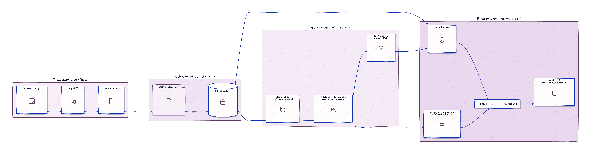
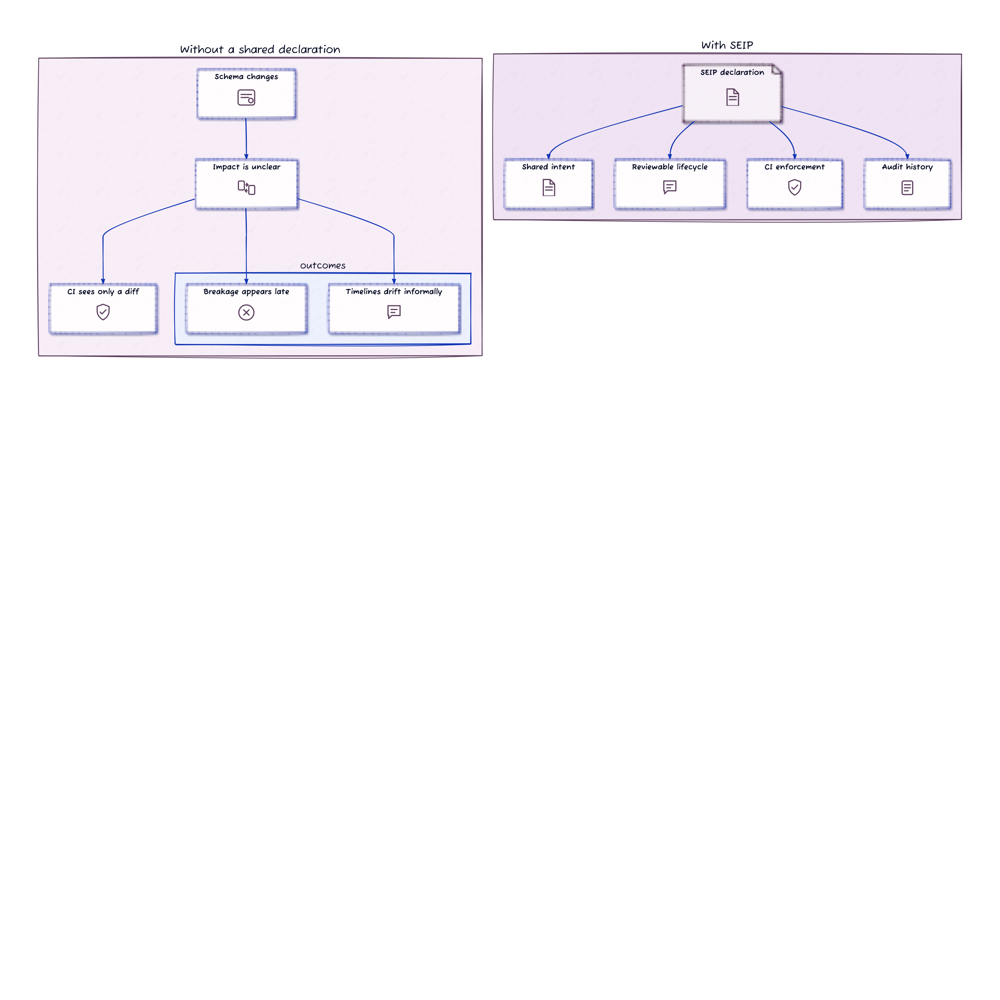
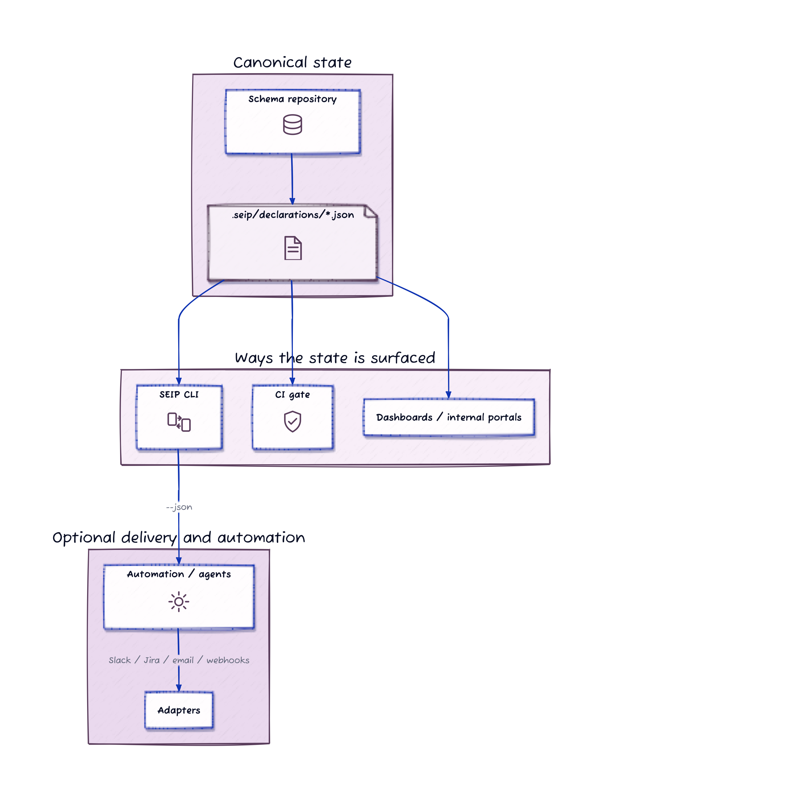
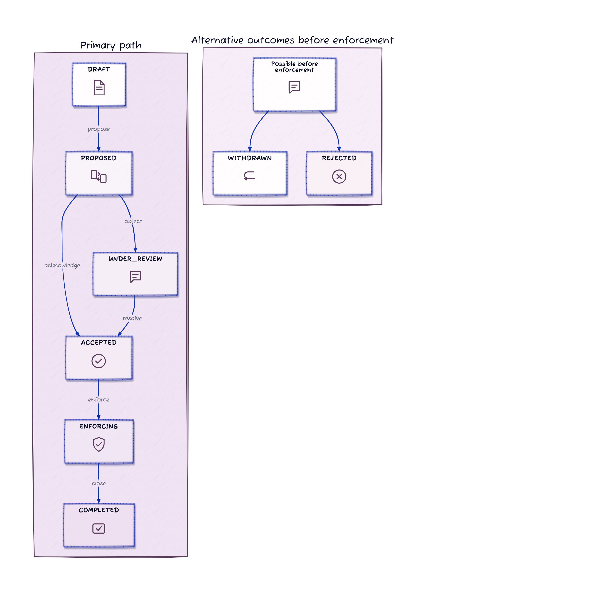
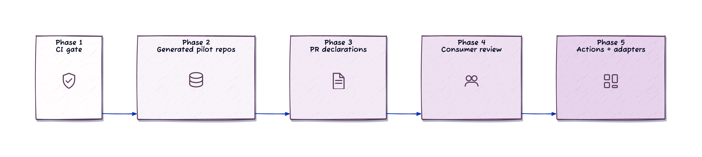

# SEIP

*Schema Evolution Intent Protocol*

## Git-Native Coordination For Breaking Schema Changes

**Whitepaper v0.3 · May 2026**

*Publication candidate. This version aligns the protocol, documentation, reference CLI, runnable demos, generated multi-repo pilot assets, and pluggable notification adapters around Git-native state and first-class data type risk.*

SEIP defines a Git-native declaration format and reference CLI for making breaking schema changes explicit, reviewable, enforceable, and auditable before rollout.

## Abstract

Breaking schema changes create coordination risk across producer and consumer teams because impact, timing, and approval state are often distributed across pull requests, tickets, release notes, and chat. The missing piece is not more process by default. It is a shared, machine-readable declaration that makes breaking intent visible before rollout.

SEIP, the Schema Evolution Intent Protocol, defines a declaration format and reference CLI for expressing schema change intent, recording review state, validating breaking changes in CI, and emitting notification payloads for existing collaboration systems. Git remains the canonical state store. GitHub pull requests, review requests, Actions checks, repository subscriptions, and organization notification settings provide the default human workflow; Slack and other tools are optional adapters that surface the same declaration state in team channels.

SEIP does not replace schema registries, migration systems, delivery pipelines, or notification platforms. It standardizes the cross-team declaration and lifecycle needed to make schema changes reviewable, enforceable, and auditable across teams.

The current reference package includes a quick lifecycle demo, an enterprise stress demo, and a generated multi-repo exhibit that creates a producer repository plus API, payments, warehouse, machine-learning, and analytics consumer repositories. These assets are intentionally executable rather than illustrative: they let evaluators inspect declaration files, schemas, validation scripts, GitHub Actions examples, consumer evidence, and audit history on disk.



*Figure 0. SEIP keeps declaration state in Git while CI, generated pilot repos, review surfaces, and adapters consume the same artifact.*

## 1. Problem Framing

Schema changes are already coordinated in most organizations. The problem is that coordination is usually fragmented.

Teams often use some combination of pull requests, change tickets, chat threads, release notes, and planning boards. These tools are useful, but they do not usually give producer and consumer teams a single shared artifact that answers:

- Is this change intended to be breaking?
- Which objects or fields are affected?
- Is a type change lossless or lossy?
- Which teams are expected to respond?
- What migration strategy and timeline are being proposed?
- How will the change be surfaced to the right reviewers?
- How do consumers validate the change before acknowledging?
- Has the change been acknowledged, objected to, accepted, enforced, or completed?

Without a shared declaration, the difference between an approved breaking change and a surprise breaking change is often visible only in human memory or scattered messages.



*Figure 1. SEIP consolidates intent, impact, timing, and response state into one declaration.*

## 2. Goals And Boundaries

SEIP is intentionally narrow.

### Goals

- Make potentially breaking schema changes visible before rollout.
- Treat data type evolution as a first-class source of compatibility risk.
- Provide a declaration format that humans and automation can both inspect.
- Support a reviewable lifecycle for producer and consumer teams.
- Preserve an append-only audit trail of the coordination process.
- Enable CI to distinguish validly declared breaking changes from undeclared or weakly declared breaking changes.
- Emit notification payloads for existing systems such as GitHub Actions, pull request comments, Slack channels, or internal portals.

### Non-Goals

- Replacing schema registries.
- Defining every source-system-specific schema diff algorithm.
- Owning downstream migration internals for every consumer.
- Replacing domain-specific contract tests or migration tooling.
- Replacing GitHub, Slack, email, dashboards, or other notification systems.
- Defining a universal cross-repository authorization or state synchronization service.

This boundary matters. A credible protocol is easier to adopt when it solves one clear problem well.

## 3. Working Definition

SEIP is a Git-native schema change coordination protocol and reference CLI for declaring, reviewing, validating, notifying, and closing cross-team schema changes.

## 4. Design Principles

### Git Is Canonical

The canonical state is a declaration JSON file stored at `.seip/declarations/<declaration_id>.json`. Git provides versioning, review, authorship, history, and merge semantics. CI reads declarations from the repository and enforces local policy.

### Distribution Is Pluggable

SEIP separates canonical state from distribution. Pull requests, Actions summaries, PR comments, Slack messages, dashboards, and internal portals can all surface the same declaration. These delivery mechanisms are adapters over protocol state, not the protocol itself.

### Compatibility Tightening Is First-Class

Schema compatibility is often decided by type evolution and constraint changes. SEIP distinguishes lossy transitions from safer widening transitions. For example, `float` or JSON Schema `number` to `integer` is treated as lossy; `int32` to `int64` can be reported as a retype without automatically making the change breaking. The reference CLI also flags generic compatibility tightening such as making an existing field required, changing nullable to non-nullable, narrowing enum values, or changing a field format. It accepts SEIP object/table fixtures and common JSON Schema object inputs, including local references, `$defs`, nested object paths, array item fields, and simple `allOf` composition.

### Consumers Validate Before Acknowledging

Consumer responses should not be blind approvals. A consumer can run local queries, parsers, ORM models, or tests against the proposed future schema before responding `ACKNOWLEDGED`, `OBJECTED`, or `EXTENSION_REQUESTED`. In the reference CLI, `validate-consumer` verifies the target exists and can run an explicit local validation command with declaration context supplied through environment variables.

### Pilot Assets Are Part Of The Product Surface

A protocol intended for real organizations needs more than a happy-path transcript. The reference package includes executable demos at three depths: a quick single-repo lifecycle, an enterprise stress demo with API, data, analytics, and machine-learning consumers, and a generated multi-repo exhibit that produces inspectable repositories with validation evidence. This makes SEIP tangible enough for platform teams, data teams, and agentic automation to evaluate without first building their own sample organization.

## 5. Core Declaration Model

SEIP is built around one primary artifact: the declaration. A declaration captures:

- the declaration id and SEIP version
- the producer team
- the change summary, type, and breaking status
- affected objects and fields
- explicit rename mappings when needed
- migration strategy and timeline
- downstream consumers and their current statuses
- consumer responses
- lifecycle events

The declaration is deliberately readable as JSON and structured enough for automation. Humans can review it in a pull request; CI and internal tooling can validate the same file.



*Figure 2. Git stores the canonical declaration while downstream surfaces render or enforce it.*

## 6. Notification Model

SEIP does not assume humans will poll a Git repository. It also does not make `consumers[].webhook` a required protocol field. Instead, the reference CLI exposes notification adapters that render the canonical declaration into delivery-specific payloads.

### GitHub As The Default Human Workflow

For organizations already using GitHub, SEIP fits naturally into existing notification mechanics:

- A pull request changing schemas and `.seip/declarations/*.json` becomes the review surface.
- GitHub review requests, team mentions, CODEOWNERS, repository watching, and issue or pull request subscriptions notify interested reviewers.
- GitHub Actions can run `seip validate`, attach summaries, or post generated Markdown to the PR.
- Users can receive notifications through the GitHub inbox, email, mobile, or Actions notification settings.

This aligns with GitHub's notification model for pull requests, issues, repositories, Actions, and subscriptions:

- [GitHub notifications](https://docs.github.com/en/subscriptions-and-notifications/concepts/about-notifications)
- [GitHub Actions notifications](https://docs.github.com/en/subscriptions-and-notifications/how-tos/managing-github-actions-notifications)

### Slack As A Pluggable Channel Adapter

Slack remains useful because schema coordination often needs a shared team room. The GitHub Slack integration can subscribe a channel to PRs, reviews, comments, workflows, and labels, and a SEIP-specific Slack adapter can post a richer Block Kit summary for a declaration.

This supports Ricardo's suggestion: people who care about a schema can join the relevant Slack channel, while SEIP still keeps Git as the source of truth. Slack is a delivery surface, not a second state store.

Relevant GitHub Slack integration docs:

- [GitHub Slack integration](https://docs.github.com/en/integrations/how-tos/slack/integrate-github-with-slack)
- [GitHub Slack notification customization](https://docs.github.com/en/integrations/how-tos/slack/customize-notifications)

## 7. Declaration Lifecycle

SEIP declarations move through a compact lifecycle:

`DRAFT -> PROPOSED -> UNDER_REVIEW -> ACCEPTED -> ENFORCING -> COMPLETED`

Additional terminal states are:

- `WITHDRAWN`
- `REJECTED`

Consumer responses shape the lifecycle:

- `ACKNOWLEDGED` means a consumer has validated or accepted the impact.
- `OBJECTED` means the change needs review or renegotiation.
- `EXTENSION_REQUESTED` means the consumer accepts the direction but needs more time.

SEIP does not prescribe how teams negotiate. It records the result in Git and makes the current state enforceable by CI.

The reference implementation enforces a conservative lifecycle boundary: only declared consumers can respond, responses are accepted only while a declaration is in review, and a declaration reaches `ACCEPTED` only when all declared consumers have acknowledged. `OBJECTED` and `EXTENSION_REQUESTED` keep the declaration in review until the negotiation is resolved.



*Figure 3. Consumer responses move declarations through review, enforcement, and closure states.*

## 8. Reference CLI Workflow

The following example uses commands supported by the current reference CLI.

### Step 1: Detect A Lossy Type Change

The `ledger-api` team changes `transaction.value` from `float` to `integer`.

```bash
npx seip diff schema-v1.json schema-v2.json --strict
```

The diff reports a lossy retype and marks the change as breaking.

### Step 2: Create A Declaration

```bash
npx seip create \
  --id seip_retype_transaction_value \
  --summary "Change transaction.value from float to integer" \
  --type retype \
  --breaking \
  --strategy dual_write \
  --producer ledger-api \
  --consumer payments-api \
  --consumer risk-service \
  --from-diff schema-v1.json schema-v2.json
```

The declaration is written to `.seip/declarations/seip_retype_transaction_value.json`.

### Step 3: Propose The Change

```bash
npx seip propose seip_retype_transaction_value --actor ledger-api
```

The declaration is now ready for consumer review.

### Step 4: Surface The Declaration

GitHub Markdown output can be posted to a PR comment or appended to `$GITHUB_STEP_SUMMARY`:

```bash
npx seip notify seip_retype_transaction_value \
  --adapter github \
  --repo-url https://github.com/acme/ledger-api
```

Slack output can be posted to a team channel:

```bash
npx seip notify seip_retype_transaction_value \
  --adapter slack \
  --webhook "$SLACK_SCHEMA_WEBHOOK" \
  --repo-url https://github.com/acme/ledger-api
```

Both adapters are rendering the same declaration state.

### Step 5: Consumers Validate And Respond

The `payments-api` team validates its local query code and acknowledges:

```bash
npx seip validate-consumer seip_retype_transaction_value \
  --against ./src/queries/ \
  --command "npm test -- --schema-change"
npx seip respond seip_retype_transaction_value \
  --team payments-api \
  --status ACKNOWLEDGED \
  --message "Validation passed; values are already truncated upstream."
```

The `risk-service` team objects because fraud models require decimal precision:

```bash
npx seip validate-consumer seip_retype_transaction_value \
  --against ./models/ \
  --command "npm test -- --fraud-model-contract"
npx seip respond seip_retype_transaction_value \
  --team risk-service \
  --status OBJECTED \
  --message "Fraud models require decimal precision."
```

Because a consumer objected, the declaration moves to `UNDER_REVIEW`.

### Step 6: Resolve Or Withdraw

If the producer withdraws the change, the current CLI records that through `close`:

```bash
npx seip close seip_retype_transaction_value \
  --status WITHDRAWN \
  --reason "Retaining decimal precision for risk-service."
```

The audit trail remains in Git.

### Step 7: Exercise The Reference Pilots

The reference package includes progressively richer demos:

```bash
npm run demo
npm run demo:enterprise
npm run demo:repos
```

`npm run demo` demonstrates the compact lifecycle. `npm run demo:enterprise` stresses one breaking event rollout across API, data, analytics, and ML consumers. `npm run demo:repos` creates an inspectable local organization with `commerce-events`, `partner-api`, `payments-ledger`, `warehouse-dbt`, `fraud-models`, and `mobile-analytics` repositories. The generated repos include schemas, validation commands, CI examples, consumer responses, and final SEIP declaration state.

## 9. CI-First Adoption Path

The smallest useful adoption wedge is a CI gate. Teams can add SEIP without rolling out a new platform:

```yaml
- name: Validate schema changes
  run: npx seip validate schema-v1.json schema-v2.json --strict
```

This immediately gives one important property: CI can fail undeclared breaking changes before merge.

For a breaking change to count as declared, the matching declaration must itself be valid, marked as breaking, use a compatible declaration type, include required migration metadata, and not be withdrawn or rejected. This prevents a weak placeholder declaration from accidentally satisfying the CI gate.

A practical rollout is:

1. Add `seip validate` to CI.
2. Run the quick, enterprise, and generated repo demos to establish the operating model.
3. Create declarations for breaking changes in one pilot repository.
4. Request reviews from affected consumers and capture validation evidence.
5. Emit GitHub or Slack notification payloads if useful.
6. Tighten policy to require minimum statuses or required consumer acknowledgements.
7. Expand to more producers only after the pilot shows response quality, ownership, and audit history are working.



*Figure 4. Teams can start with a CI gate, prove the operating model with generated repos, and add richer review or notification surfaces later.*

## 10. Automation Interface

The CLI exposes machine-readable output for automation:

```bash
npx seip diff schema-v1.json schema-v2.json --json
npx seip validate schema-v1.json schema-v2.json --json
npx seip status seip_retype_transaction_value --json
npx seip log seip_retype_transaction_value --json
npx seip validate-consumer seip_retype_transaction_value --against ./src/queries --json
npx seip notify seip_retype_transaction_value --adapter github --json
```

This lets CI jobs, internal portals, and agents consume the same state humans review in Git.

Agentic actors can use these JSON surfaces to detect undeclared breaking changes, prepare declaration drafts, run consumer validation commands, summarize objections, and post review evidence. SEIP should not give agents a blank-check approval role. The useful boundary is evidence production and state transition assistance: agents can propose, validate, summarize, and record, while organization policy decides which transitions require human review.

## 11. Migration Scope

SEIP records migration intent; it does not own every migration detail.

The producer can declare:

- compatibility strategy
- affected objects and fields
- proposed review, deprecation, and removal dates
- consumer response state

Consumers still own their local migration work. One consumer may need a simple field rename. Another may need a backfill, reindex, parser change, or model retraining. SEIP gives those consumers a durable place to respond and gives CI a durable state to enforce. The consumer validation hook is deliberately command-based so teams can connect their existing parser tests, query checks, dbt builds, contract tests, or model rehearsals instead of waiting for SEIP to understand every downstream runtime.

## 12. Current Limitations

The reference implementation is intentionally small.

Current limits include:

- Diffing is generic and not source-system-specific, even though it now recognizes common compatibility tightening patterns and common JSON Schema object inputs. It is not a full JSON Schema dialect engine; remote references, full `oneOf` or `anyOf` semantics, Avro compatibility modes, dbt model lineage, and SQL DDL parsing remain adapter-specific.
- Rename detection is heuristic unless explicit rename mappings are supplied.
- `validate-consumer` verifies a target and can run a local command, but it remains a reference hook rather than a universal contract testing engine.
- Notification adapters emit payloads; the GitHub adapter does not call the GitHub API directly.
- Cross-repository authorization and state synchronization remain organization-specific.
- Generated demo repositories are local pilot assets, not a hosted multi-repo control plane. They prove workflow shape and integration points, but production adoption still needs organization-specific repository permissions, CODEOWNERS, branch protection, and CI policy.
- Review deadline behavior is policy-driven; SEIP does not auto-accept or auto-reject missed responses.

These limits are appropriate for a protocol that aims to be adopted incrementally rather than introduced as a heavyweight platform.

## 13. Conclusion

SEIP is a narrow proposal: a schema change declaration format and reference CLI for coordinating breaking changes before rollout.

Its immediate value is operational. CI can distinguish validly declared breaking changes from undeclared or weakly declared ones. Its broader value is organizational. Producer and consumer teams gain a shared artifact, a reviewable lifecycle, notification hooks for existing collaboration systems, and an audit trail that persists beyond transient coordination channels.

The robust version of SEIP is not "Git plus Slack." It is Git as canonical state, CI as enforcement, GitHub as the natural review and notification surface for many teams, Slack as a useful pluggable channel, and declarations as the durable contract between producers and consumers.

The next proof point is a real pilot integration: one producer, two or more actual downstream consumers, one enforced CI gate, and a recorded response cycle that can survive normal engineering pressure. The reference package now includes a pilot integration guide for that transition from generated exhibits to real repositories.

## Appendix: Diagram Sources

- `docs/diagrams/hero-overview.d2`
- `docs/diagrams/problem-framing.d2`
- `docs/diagrams/roles.d2`
- `docs/diagrams/canonical-model.d2`
- `docs/diagrams/lifecycle.d2`
- `docs/diagrams/adoption-wedge.d2`
